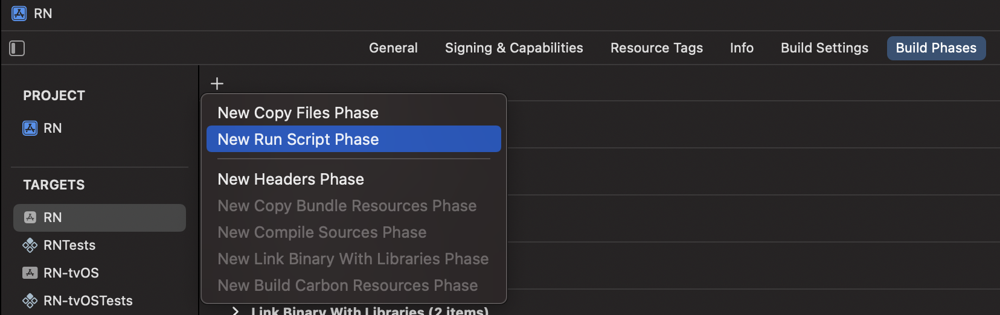
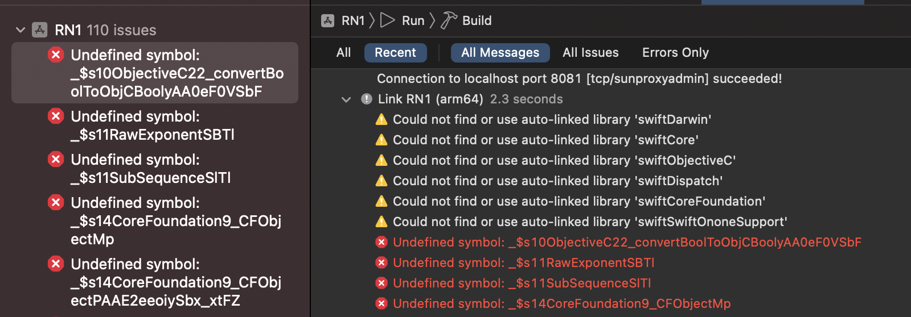
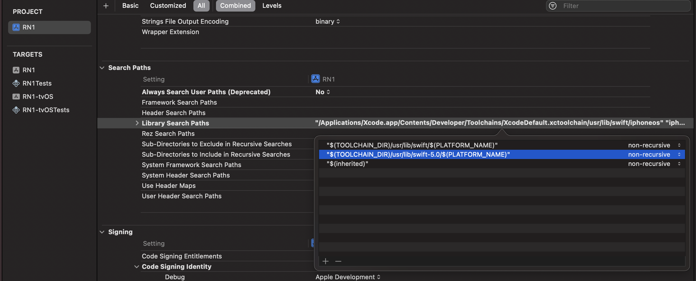

# iOSIntegrity

## Requirements

Good mood

## Add Package Dependency
To add a package dependency to your Xcode project, Select Project -> Select Package Dependencies -> Click on plus button (lower left corner)


In the next window search following url `https://github.com/tilakkap/iOSIntegrity` and click Add Package


Select iOSIntegrity and click Add Package


## Installation in IOS 

### Step 1: Create New Swift Class
Add a `.swift` file to your project, and name it `IntegrityCheck.swift`.

In `IntegrityCheck.swift`:

```swift
import Foundation
import iOSIntegrity

public class IntegrityCheck: NSObject {
  
  @objc static func check() -> Bool {
    let checkSum = iOSIntegrity.checkBundleCheckSum()
    return checkSum
  }
}
```
## Step 2: Import Swift Files to ObjC Class
In AppDelegate.m:

```objectivec
#import "<#YourProjectName#>-Swift.h"
```

The file:`<#YourProjectName#>-Swift.h` should already be created automatically in your project, even if you can not see it.

## Step 3: Add following code to application method in AppDelegate.m
before 
```objectivec
[self.window makeKeyAndVisible];
```


```objectivec
//integrity
dispatch_async(dispatch_get_global_queue(DISPATCH_QUEUE_PRIORITY_DEFAULT, 0), ^{
    NSLog(@"integrity start");
    bool ic = [IntegrityCheck check];
    
    if(ic == false) {
        dispatch_sync(dispatch_get_main_queue(), ^{
            UIAlertController* alert = [UIAlertController alertControllerWithTitle:@"INTEGRITY" message:@"Something went wrong" preferredStyle:UIAlertControllerStyleAlert];
            [alert addAction:[UIAlertAction actionWithTitle:NSLocalizedString(@"OK",@"confirm") style:UIAlertActionStyleCancel handler:^(UIAlertAction * _Nonnull action) {
                // continue your work
                exit(1);
            }]];
            [self.window.rootViewController presentViewController:alert animated:YES completion: nil];
        });
    }
});
```

# Install Build Phase

## Step 1: Add custom Run Script in Build Phases  

Select xcodeproj file of you project -> Select Target -> Select Build Phases -> Click on plus button (upper left corner) -> Select New Run Script Phase.


Xcode will add a empty script


Put following code in the script window
```shell
LOGFILE="$HOME/Desktop/xcode-post-action.txt" ;
EXE="${ARCHIVE_PATH}/Products/Applications/${FULL_PRODUCT_NAME}/${PRODUCT_NAME}"

echo "" > $LOGFILE ;
echo "Build Post-Action" >> $LOGFILE
plutil -convert xml1 "${ARCHIVE_PATH}/Products/Applications/${FULL_PRODUCT_NAME}/Info.plist"
SDKROOT=macosx
echo "EXE" "${EXE}" >> $LOGFILE
MACHO=$(otool -l "${EXE}" | grep -A 4 __text | grep 'offset\|size')
echo "MACHO" "${MACHO}" >> $LOGFILE
SIZE=$(echo "${MACHO}" | sed -n 1p | sed 's/size \(.\)/\1/g' | sed -e 's/[[:space:]]*//')
echo "SIZE" $SIZE >> $LOGFILE
SKIP=$(echo "${MACHO}" | sed -n 2p | sed 's/offset \(.\)/\1/g' | sed -e 's/[[:space:]]*//')
echo "SKIP" $SKIP >> $LOGFILE
MACHO_HASH=$(dd if="${EXE}" ibs=1 skip="${SKIP}" count="${SIZE}" | shasum -a 256 | sed 's/[[:space:]-]*//g')
echo "MACHO_HASH" $MACHO_HASH >> $LOGFILE
echo "BUIDDIR" ${BUILD_DIR%Build/*} >> $LOGFILE
cd ${BUILD_DIR%Build/*}SourcePackages/checkouts/iOSIntegrity
swift run -c release iOSIntegrityCli "${ARCHIVE_PATH}/Products/Applications/${FULL_PRODUCT_NAME}" "${MACHO_HASH}" >> $LOGFILE
```


# Problems M1

Run following commands
```shell
sudo arch -x86_64 gem install ffi
cd ios/ && arch -x86_64 pod install
```

# Problems React Native Version < 0.64

If you faced following build errors



Select your project in Xcode, and go to "Build Settings". Scroll down until you see "Search Paths", and finally, "Library Search Paths"



Replace `$(TOOLCHAIN_DIR)/usr/lib/swift-5.0/$(PLATFORM_NAME)` with `$(SDKROOT)/usr/lib/swift`.